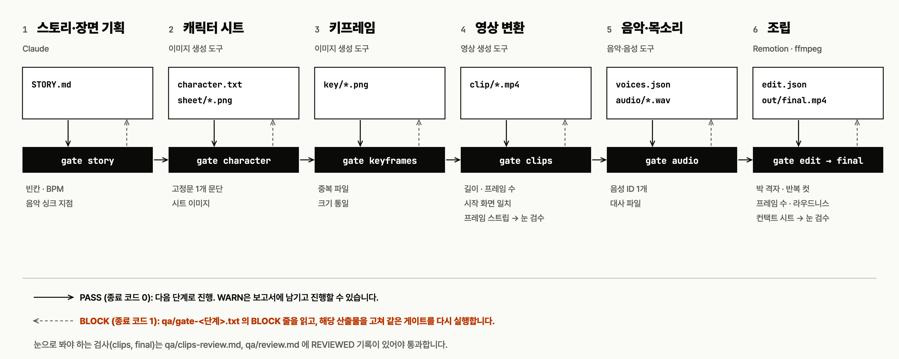
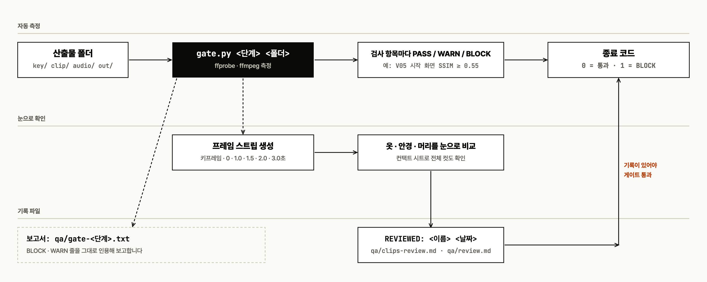
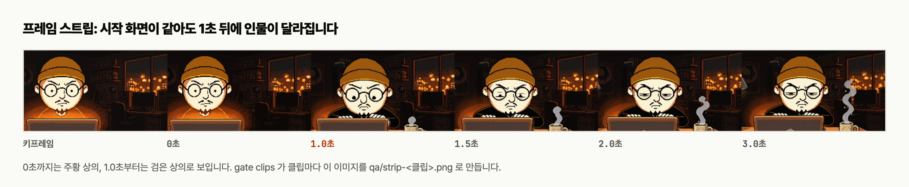
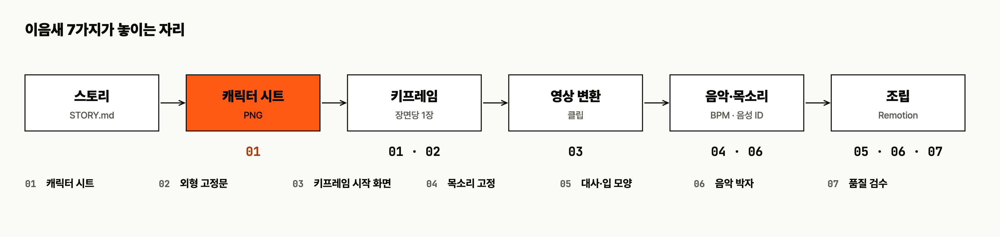

# motion-video-production

[한국어](README.md) | [English](README.en.md)

모션 그래픽과 영상(30~90초)을 처음부터 끝까지 만드는 순서와 점검 기준을 담은 **Claude Code 스킬**입니다.
제작 6단계마다 산출물을 측정해 통과 여부를 종료 코드로 판정하는 검사 스크립트(`harness/gate.py`, 이하 게이트)와, 자주 생기는 함정 29가지의 예방법(`references/gotchas.md`)이 들어 있습니다.



## 설치

Claude Code는 `~/.claude/skills/<스킬 이름>/SKILL.md`를 스킬로 읽습니다.

```bash
git clone https://github.com/unclejobs-ai/motion-video-skill.git
mkdir -p ~/.claude/skills
cp -r motion-video-skill/skills/motion-video-production ~/.claude/skills/
```

특정 프로젝트에서만 쓰려면 프로젝트 폴더의 `.claude/skills/` 아래에 같은 폴더를 복사합니다.
복사한 뒤 Claude Code를 새로 시작하고 아래처럼 요청하면 스킬이 호출됩니다.

> 캐릭터가 나오는 30초짜리 오프닝 영상을 만들고 싶어.

Claude가 먼저 4가지(공개 방식, 길이와 화면비, 쓸 수 있는 도구, 금지 요소)를 묻고, `STORY.md`부터 단계 순서대로 진행합니다.

## 사용 흐름

1. 스킬이 단계 산출물을 만듭니다 (`STORY.md`, `character.txt`, `key/`, `clip/`, `voices.json`, `edit.json`).
2. 단계가 끝나면 `python3 harness/gate.py <단계> <프로젝트폴더>`를 실행합니다.
3. 종료 코드 0이면 다음 단계로 넘어갑니다. 1(BLOCK)이면 `qa/gate-<단계>.txt`의 BLOCK 줄을 읽고 산출물을 고쳐 같은 게이트를 다시 실행합니다.
4. 눈으로 봐야 하는 검사는 스크립트가 판정할 수 없습니다. 프레임 스트립을 보고 남긴 기록 파일(`qa/clips-review.md`, `qa/review.md`)이 있어야 통과합니다.


`gate.py clips` 실행 예시입니다. 눈 검수 기록이 없어서 BLOCK(종료 코드 1)이 나오고, 기록을 남기면 PASS(종료 코드 0)가 됩니다. 기록은 프레임 스트립 이미지(`qa/strip-<클립>.png`)를 연 뒤에 씁니다.

## 하네스



| 제작 단계 | 게이트 | 하는 검사 |
|---|---|---|
| 1. 스토리·장면 기획 | `story` | 빈칸, BPM, 음악 싱크 지점 표(시간이 숫자인지), 장면 표 |
| 2. 캐릭터 시트 | `character` | `character.txt`가 1개 문단 평문인지, 색 표현, 시트 이미지 |
| 3. 키프레임 | `keyframes` | 중복 파일, 클립과의 화면비 |
| 4. 영상 변환 | `clips` | 길이, 프레임 수, 시작 화면 일치, 프레임 스트립 생성, 클립별 판정 기록 |
| 5. 음악·목소리 | `audio` | 음성 ID 1개, 대사 파일 |
| 6. 조립 | `edit`, `final` | 박 격자, 컷 연결, 반복 컷, 대사 길이, 프레임 수, 오디오, 라우드니스, true peak, 검수 기록 |

### 프레임 스트립

시작 화면이 키프레임과 같아도 1~2초 뒤에 인물이 달라지는 클립이 있습니다. `gate clips`가 클립마다 키프레임, 0, 1.0, 1.5, 2.0, 3.0초를 한 줄에 놓은 이미지를 만듭니다.



SSIM 같은 화면 유사도 값은 인물의 움직임과 인물의 변형을 구분하지 못합니다(`gotchas.md` G02). 게이트는 시작 화면 일치만 숫자로 판정하고, 뒤쪽 프레임은 사람이 보고 기록하게 합니다.

### 하네스 점검

설치한 뒤 `bash skills/motion-video-production/harness/selftest.sh`를 실행합니다. 종료 코드 0이면 이 컴퓨터에서 게이트가 정상 동작합니다. (ffmpeg, ffprobe, Python 3 필요)

## 캐릭터 일관성 7가지

장면이 바뀌어도 얼굴과 목소리를 같게 유지하는 7가지 기준(캐릭터 시트, 외형 고정문, 키프레임 시작 화면, 목소리 고정, 대사와 입 모양, 음악 박자, 품질 검수)이 제작 6단계의 어느 이음새에 놓이는지는 아래 그림과 `skills/motion-video-production/references/consistency-7.md`에 있습니다.



## Gotchas

전체 29가지는 [`references/gotchas.md`](skills/motion-video-production/references/gotchas.md)에 증상, 원인, 예방, 하네스 검사 ID로 정리되어 있습니다. 자주 부딪히는 것:

- 클립은 시작 화면이 같아도 1~2초 뒤에 옷, 안경, 머리가 바뀝니다. (G01)
- 컷 길이는 초가 아니라 박의 배수로 정하고, 시작 프레임은 누적 시간에서 한 번만 반올림합니다. (G11, G12)
- 대사 길이를 먼저 재고 컷 길이를 정합니다. (G13)
- `검사 | tail`처럼 파이프로 자르면 종료 코드가 사라집니다. (G21)
- ICC 프로파일이 붙은 영상에서 `ffprobe -of csv=p=0`은 프레임 수를 `30,`처럼 출력합니다. `-of default=nw=1:nk=1`을 씁니다. (G27)
- ffmpeg에서 `adelay` 뒤에 `apad`, `atrim`을 쓰면 지연이 사라집니다. `asetpts=N/SR/TB`가 필요합니다. (G26)

## 필요한 도구

무료 범위와 상업 이용 조건은 `NOTICE.md` 요약과 `skills/motion-video-production/references/licensing.md`(2026-10-02 확인, 출처 URL 포함)에 있습니다. 요금과 약관은 자주 바뀌므로 작업 직전에 다시 확인합니다.

| 도구 | 용도 |
|---|---|
| Claude Code | 제작 진행·조립 |
| ffmpeg, Python 3 | 하네스·스크립트 실행 |
| Node.js + Remotion | 모션 그래픽·조립 |
| ChatGPT / Grok Imagine | 이미지·영상 생성 |
| Suno | 음악 |
| ElevenLabs, Fish Audio | 목소리 |
| whisper | 받아쓰기 검수 (`verify.sh`의 받아쓰기 연동은 미검증) |

## 저장소 구조

```
README.md
LICENSE                     MIT
NOTICE.md                   외부 도구 안내 요약
docs/assets/                README 이미지
skills/motion-video-production/        설치하는 스킬 폴더 (아래 전체가 함께 복사됩니다)
  SKILL.md                  스킬 본문
  references/               일관성 7가지, 박 격자, 비용 규칙, 도구 메모, gotchas, licensing(외부 도구 이용 조건)
  harness/                  gate.py(단계별 통과 여부 판정), selftest.sh(하네스 자체 검증)
  scripts/                  dupcheck.py, clipsheet.sh, key-plate.sh, mix-mux.sh, verify.sh, beat-grid.py
  templates/                STORY.md, CHARACTER_SHEET.md, PROMPTS.md, SCENE_AUDIT.md
```

Remotion 컴포지션 코드는 이 저장소에 포함되어 있지 않습니다. Remotion을 직접 설치해 사용합니다.

## 책임 범위

생성물의 권리와 책임은 `NOTICE.md`와 `skills/motion-video-production/references/licensing.md`에 있습니다.
